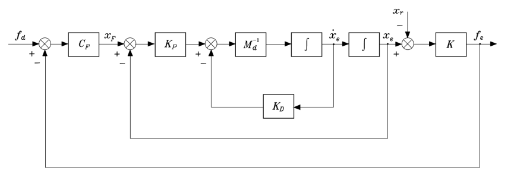
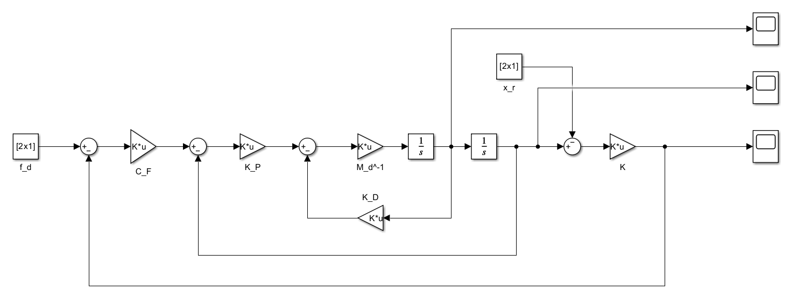
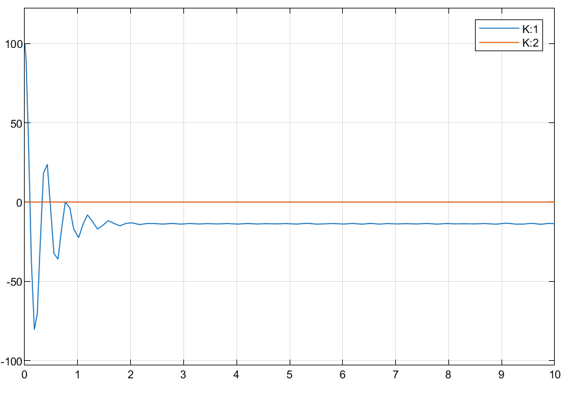
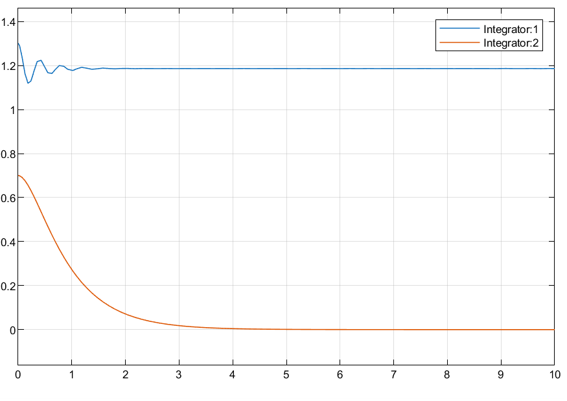
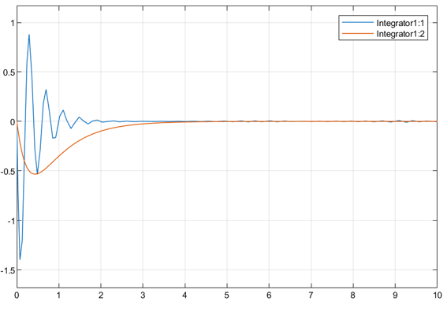
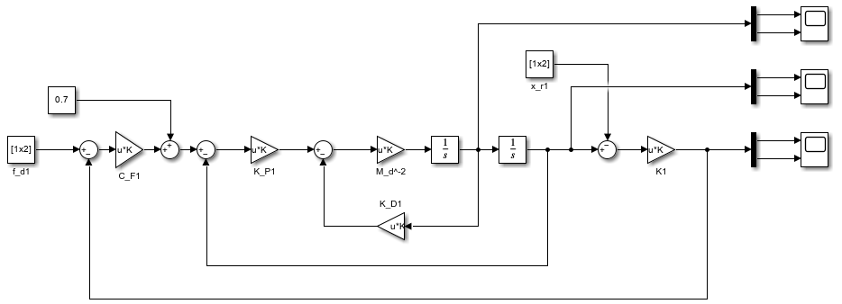
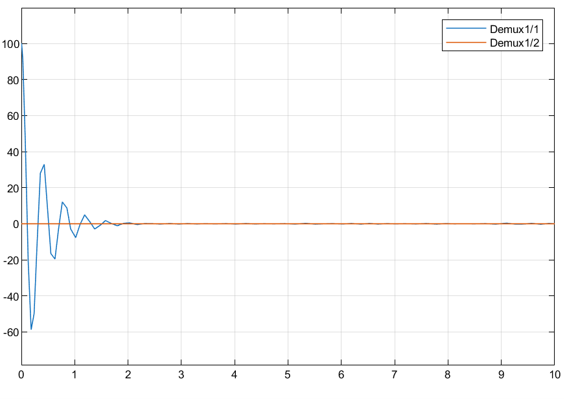
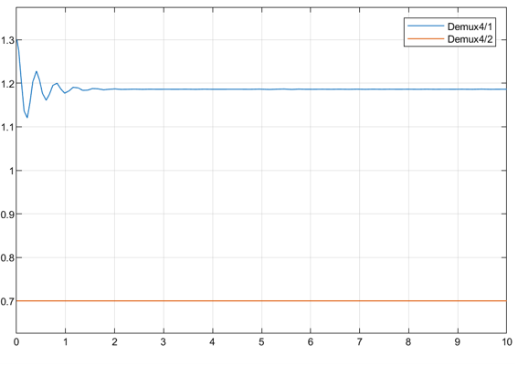
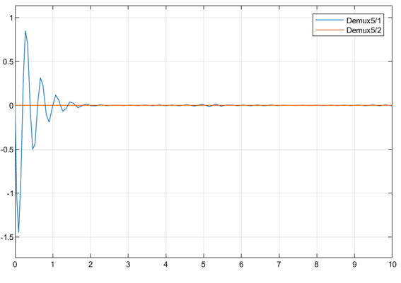

# Lab-5-Force-Control

## Introducción

En esta práctica se estudia el control de fuerza de un manipulador robótico en contacto con una superficie elástica. Para ello, se analiza mediante Simulink un esquema de control de fuerza con lazo interno de posición, comparando el comportamiento de controladores P y PI para el seguimiento de una fuerza de referencia.

---

## Tarea 1: Simular un Control P

---

### Fundamentos Teóricos

Se realiza la ley de control explicada en anteriores informes (en esta ocasión se añaden las fuerzas externas):

$$
\tau = M(q)\ddot{q}_d + C(q,\dot{q})\dot{q} + F_b\dot{q} + g(q) + J^T(q)f_e
$$

Donde:

- $$\(M(q)\)$$: matriz de inercia.
- $$\(C(q,\dot{q})\)$$: matriz de Coriolis y centrífuga.
- $$\(F_b\)$$: fricción viscosa.
- $$\(g(q)\)$$: vector gravitatorio.
- $$\(J(q)\)$$: jacobiano.
- $$\(f_e\)$$: fuerza externa aplicada.

Por consiguiente, el comportamiento cinemático resultante es:

$$
\ddot{q} =
J^{-1}(q)
\left(
\ddot{x} - \dot{J}(q,\dot{q})\dot{q}
\right)
$$

Siendo la ecuación de bucle cerrado:

$$
M_d\ddot{x}_e + K_D\dot{x}_e + K_P(I + C_FK)x_e = K_PC_F(Kx_r + f_d)
$$

Gráficamente:

 
Donde se introduce una fuerza deseada para realizar un control interno de posición a través del controlador $$C_F$$, siendo:

- $$x_F$$ la referencia de posición que sirve de input al sistema y $$f_d$$ la fuerza deseada:

$$
x_F = C_F(f_d - f_e)
$$

- $$f_e$$ se trata de la fuerza elástica aplicada por el robot en la superficie:

$$
f_e = K(x_e - x_r)
$$

El siguiente paso es introducir los valores del problema:

- Posición inicial:

$$
x_{e,initial} = \begin{bmatrix} 1.3\\ 0.7 \end{bmatrix} m
$$

- Posición de contacto:

$$
x_r =
\begin{bmatrix}
1.2\\
0.7
\end{bmatrix}
m
$$

- Fuerza deseada:

$$
f_d =
\begin{bmatrix}
10\\
0
\end{bmatrix}
N
$$

- Rigidez del entorno:

$$
K=
\begin{bmatrix}
1000 & 0\\
0 & 0
\end{bmatrix}
N/m
$$

- Ganancia de fuerza:

$$
C_F=
\begin{bmatrix}
0.05 & 0\\
0 & 0
\end{bmatrix}
$$

- Masa deseada:

$$
M_d=
\begin{bmatrix}
1000 & 0\\
0 & 1000
\end{bmatrix}
$$

- Amortiguamiento deseado:

$$
K_D=
\begin{bmatrix}
5000 & 0\\
0 & 5000
\end{bmatrix}
$$

- Rigidez deseada:

$$
K_P=
\begin{bmatrix}
5000 & 0\\
0 & 5000
\end{bmatrix}
$$

De esta forma, el esquema en Simulink queda definido según:

---

### Resultados

Se muestran la evolución de las siguientes variables en el dominio del tiempo:

- Fuerza aplicada:

- Posición del efector final:

- Velocidad del efector final:

Se observa un comportamiento inesperado del manipulador, ya que, la posición en el eje Y disminuye hasta caer el brazo al Y=0. Esto es debido a que:

- La referencia de fuerza en el eje Y es 0.
- La fuerza aplicada en este eje también es nula.

Por lo tanto el error de fuerza en el eje Y es 0, enviando la orden de no aplicar ninguna fuerza al manipulador. Una posible solución sería la siguiente:

Se trata de enviar una consigna de posición en el eje Y para evitar que caiga al suelo, quedando así sus gráficas:

- Fuerza aplicada:

- Posición del efector final:

- Velocidad del efector final:

Se observa en la gráfica de posición que el manipulador no cae. Otra solución podría ser realizar un control híbrido de fuerza y movimiento.

---

## Tarea 2: Simular un Control PI

---

### Fundamentos Teóricos

Control PI de fuerza

$$
C_F = K_F + K_I \int (\cdot)\, d\zeta
$$

---

### Resultados

## Conclusión

o equivalentemente:

$$
x_F =
K_F(f_d-f_e)
+
K_I\int (f_d-f_e)\,dt
$$
